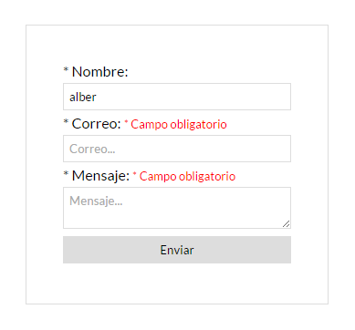
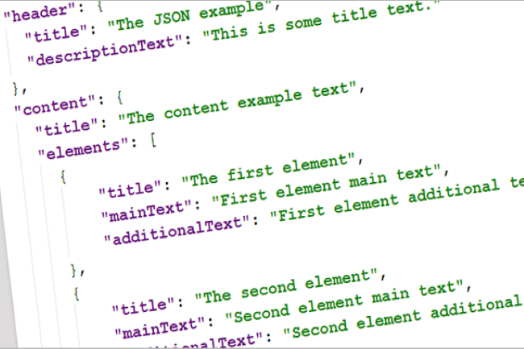

.. toctree::
   :glob:
   :hidden:

   *

.. _intro:

=================================
¿Qué hay de nuevo en Python 3.11?
=================================

.. image:: images/drf_logo.*

.. Hola a todos.

👋
==

.. Hacía mucho que no nos reuníamos para celebrar un meetup Python Málaga.

Marzo 2020
----------

.. La última vez fue el 4 de marzo de 2020. Mes que muchos recordaréis.

Estamos de vuelta
-----------------

.. code-block:: python

    >>> import datetime
    >>> import humanize
    >>> delta = datetime.datetime(2022, 10, 27) - datetime.datetime(2020, 3, 4)
    >>> humanize.i18n.activate("es_ES")
    >>> print(humanize.precisedelta(delta))
    2 años, 7 meses y 23 días

.. Pero ya estamos aquí. 2 años, 7 meses y 23 días después.

Python Málaga
-------------

.. Y quiero agradecer tanto a Python Málaga como a Codespace por cedernos este espacio, por la oportunidad de estar
   aquí todos juntos de nuevo. Gracias.

.. _sobre-mi:

Sobre mí **Nekmo**
------------------

+-----------------------------------+
|                                   |
| .. image:: images/cara.svg        |
|   :width: 200px                   |
|                                   |
| *Django desde versión 1.1 (2009)* |
|                                   |
+-----------------------------------+

.. Pero bueno, dejad de que me presente. Soy Juan José, más conocido en redes como Nekmo, y llevo programando en
   Python más de media vida.

Python 2.5
----------

.. Mi primera versión de Python fue la 2.5, allá por 2006. Han pasado ya muchos años, y con cada nueva versión no
   dejan de traer novedades.

¿Qué hay de nuevo en Python 3.11?
=================================

.. Ahora, ¿qué hay de nuevo en Python 3.11?

Listado cambios
---------------

* **PEP 654:** Exception Groups y except*.
* **PEP 678:** Exceptions can be enriched with notes.
* **PEP 680:** tomllib.
* **PEP 678:** Enriquecer excepciones con notas.
* **PEP 657:** Mejoras en las indicaciones de error en los tracebacks.
* Opción ``-P`` en la línea de comandos y variable de entorno ``PYTHONSAFEPATH``.
* **PEP 646:** Variadic Generics.
* **PEP 655:** Marcar individualmente elementos de un TypedDict como requeridos o potencialmente indefinidos.
* **PEP 673:** Tipo Self.
* **PEP 675:** Tipo de cadena literal arbitraria
* **PEP 681:** Data Class Transforms
* Módulos obsoletos (PEP 594),  Py_UNICODE API eliminada (PEP 624) y macros convertidas a funciones estáticas en línea
  (PEP 670).

.. Pues este sería el listado de todos los cambios, los cuales se pueden consultar en la web oficial de Python.

Muchas gracias
--------------

.. Y hasta aquí la charla. Muchas gracias a todos por venir. (PAUSA) Ahora en serio, vamos a ir viendo cada uno de
   estos cambios, aunque me tendré que detener bastante en el primero de ellos porque es el más importante y más
   interesante.

PEP 654: Exception Groups y except*
===================================

.. La primera de estas novedades son los exception groups y el nuevo except* con asterisco, con PEP 654.

.. revealjs_break::
    :notitle:

.. code-block:: python

    class NameError(Exception):
        pass

    def validate_name(value: str) -> None:
        if not value.istitle():
            raise NameError("El nombre debe empezar por mayúscula.")

    form = {"name": "nekmo"}
    try:
        validate_name(form["name"])
    except NameError as err:
        print(err)  # Salta el error

.. Aquí tenemos una excepción tradicional de Python, a lo cual lo normal es lanzar una única excepción y capturarla.
   En la función validamos la entrada, y si no valida se lanza una excepción, la cual se captura en el except y
   se muestra por pantalla.

.. revealjs_break::
    :notitle:

.. Pero en nuestro caso tenemos un formulario. Un formulario en el que nuestro usuario comete varios errores, y
   queremos mostrarle al usuario todos los errores de golpe, no excepción por excepción. Necesitamos agruparlos.

.. revealjs_break::
    :notitle:

.. code-block:: python

    from typing import Iterable, Tuple, Dict, Callable

    class NumberError(Exception):
        pass

    def validate_age(value: str) -> None:
        if not value.isdigit():
            raise NumberError("La edad debe ser un valor numérico.")

    form = {"name": "nekmo", "age": "diez"}
    form_validations = [("name", validate_name), ("age", validate_age)]
    exceptions = []

    for form_key, input_validation in input_validations:
        try:
            input_validation(form[form_key])
        except Exception as err:
            exceptions.append(value)
    if exceptions:
        raise ExceptionGroup("errors message", exceptions)

.. En este segundo ejemplo iteramos sobre todos los valores del formulario, aplicamos su validación y si hay un
   error lo añadimos al listado de excepciones. Si hay errores lanzamos el ExceptionGroup con sus exceptions.

.. revealjs_break::
    :notitle:

.. Esto como os imaginaréis es muy útil en casos como un JSON, o cuando nos vienen varios datos de entrada a validar,
   como en el ejemplo del formulario. Pero claro, os estaréis preguntando. ¿Para qué esto si sólo es crear un listado
   de excepciones con un nuevo tipo de excepción?

except*
-------

.. La verdadera novedad  comienza usando el nuevo except con asterisco.

.. revealjs_break::
    :notitle:

.. code-block:: python

    try:
        read_inputs()
    except* NameError as eg:
        # Si hay errores NameError esto se llama
        print(f"Errores en el nombre: {eg.exceptions}")
    except* NumberError as eg:
        # Y si hay errores NumberError, esto también
        print(f"Errores numéricos: {eg.exceptions}")

.. Podemos utilizarlo para capturar múltiples exceptiones agrupadas diferenciadas por tipo. Y lo que es mejor, a
   diferencia de lo habital que es que el except no continúe ante la primera coincidencia, con el except con asterísco
   sí que sigue. (LEER EJEMPLO).

.. revealjs_break::
    :notitle:

.. code-block:: python

    raise ExceptionGroup("nested",
        [
             ValueError(654),
             ExceptionGroup("imports",
                 [
                     ImportError("no_such_module"),
                     ModuleNotFoundError("another_module"),
                 ]
             ),
             TypeError("int"),
         ]

.. Por si fuese poco, también podemos meter excepciones dentro de otras. Esto es especialmente útil en casos como un
   JSON, en que tenemos múltiples niveles. También es útil en ejecución asíncrona, en que varias funciones lanzan a
   su vez varias excepciones. Justamente algo similar al ExceptionGroup lo tenía Trio con el MultiError,
   aunque ahora lo tenemos de serie.

¡Continuamos!
=============

.. revealjs_section::
    :data-background-color: #000000
    :data-background-image: _static/applause.gif

.. No os preocupéis, esto era lo gordo. Lo que viene son cambios más pequeños, pero muchos muy interesantes.

PEP 678: Enriquecer excepciones con notas
=========================================

.. Y seguimos con excepciones. El nuevo método PEP 678 permite añadir notas, aclaraciones, a las excepciones que se
   lanzan.

.. revealjs_break::
    :notitle:

.. code-block:: python

    try:
         raise TypeError('bad type')
    except Exception as e:
         e.add_note('¡Ah, ah, ah! ¡No has dicho la palabra mágica!')
         raise

.. En este ejemplo se añade produce una excepción, se captura, se le añade una nota usando el nuevo método add_note,
   disponible en Exception, y se vuelve a lanzar ya con la nota.

.. revealjs_break::
    :notitle:

.. code-block:: python

    Traceback (most recent call last):
      File "<stdin>", line 2, in <module>
    TypeError: bad type
    Add some information

.. Y cuando se produce la excepción, la nota es mostrada en una segunda línea. Así se simple. Genial para aclaraciones y
   otras anotaciones.

.. revealjs_break::
    :notitle:

.. code-block:: python

    + Exception Group Traceback (most recent call last):
    |   File "test.py", line 4, in test
    |     def test(x):
    |
    |   File "hypothesis/core.py", line 1202, in wrapped_test
    |     raise the_error_hypothesis_found
    |     ^^^^^^^^^^^^^^^^^^^^^^^^^^^^^^^^
    | ExceptionGroup: Hypothesis found 2 distinct failures.
    +-+---------------- 1 ----------------
        | Traceback (most recent call last):
        |   File "test.py", line 6, in test
        |     assert x > 0
        |     ^^^^^^^^^^^^
        | AssertionError: assert -1 > 0
        |
        | Falsifying example: test(
        |     x=-1,
        | )
        +---------------- 2 ----------------
        | Traceback (most recent call last):
        |   File "test.py", line 5, in test
        |     assert x < 0
        |     ^^^^^^^^^^^^
        | AssertionError: assert 0 < 0
        |
        | Falsifying example: test(
        |     x=0,
        | )
        +------------------------------------

.. Y por supuesto, esto también puede utilizarse con los ExceptionGroup - Ya veis lo que me gustan - de forma que
   añadimos información adicional sobre la parte del exception group en que ha sucedido. Y de paso, ¡ahora podéis
   conseguir que vuestros tracebacks den miedo! Como este de aquí.

PEP 657: Mejoras en las indicaciones de error en los tracebacks
===============================================================

.. Y seguimos con tracebacks de error. Vamos a ver las mejoras que se han hecho en los mensaje de traceback.

.. revealjs_break::
    :notitle:

.. code-block:: python

    Traceback (most recent call last):
      File "distance.py", line 11, in <module>
        print(manhattan_distance(p1, p2))
      File "distance.py", line 6, in manhattan_distance
        return abs(point_1.x - point_2.x) + abs(point_1.y - point_2.y)
    AttributeError: 'NoneType' object has no attribute 'x'

.. Hasta ahora en Python, como recordaréis lo habitual cuando hay varias variables en una sola línea y una de ellas es
   None, la única forma de encontrar la que provocaba el error era ponerse a depurar, porque el error no da bastante
   información.

.. code-block:: python

    Traceback (most recent call last):
      File "distance.py", line 11, in <module>
        print(manhattan_distance(p1, p2))
              ^^^^^^^^^^^^^^^^^^^^^^^^^^
      File "distance.py", line 6, in manhattan_distance
        return abs(point_1.x - point_2.x) + abs(point_1.y - point_2.y)
                               ^^^^^^^^^
    AttributeError: 'NoneType' object has no attribute 'x'

.. Pero ahora con Python 3.11, ¡ya no hace falta depurar! Porque ahora tienes flechitas que te indican lo que es un
   None. Y no hay nada más fácil que seguir flechitas que indican lo que tienes que arreglar, ¿no?

.. revealjs_break::
    :notitle:

.. code-block:: python

    Traceback (most recent call last):
      File "query.py", line 37, in <module>
        magic_arithmetic('foo')
      File "query.py", line 18, in magic_arithmetic
        return add_counts(x) / 25
               ^^^^^^^^^^^^^
      File "query.py", line 24, in add_counts
        return 25 + query_user(user1) + query_user(user2)
                    ^^^^^^^^^^^^^^^^^
      File "query.py", line 32, in query_user
        return 1 + query_count(db, response['a']['b']['c']['user'], retry=True)
                                   ~~~~~~~~~~~~~~~~~~^^^^^
    TypeError: 'NoneType' object is not subscriptable

.. Y el caso en que esto me ha parecido más útil es accediendo a diccionarios. Seguro que os ha pasado alguna vez
   acceder a un diccionario dentro de otro dentro de otro, y que a partir de cierto punto sea un None y no saber en
   qué nivel ocurre. Pues ahora se te indica. Con flechitas. ¿Qué más podemos pedir?

PEP 680: tomllib
================

.. Y ahora, algo completamente diferente. Tenemos un nuevo módulo en la biblioteca estándar, Tomlib. ¿Pero qué significa
   TOML?

.. revealjs_break::
    :notitle:

Tom's Obvious, Minimal Language
-------------------------------

.. Pues obviamente, Tom's Obvious Minimal Language. ¿Y por qué Tom?

.. revealjs_break::
    :notitle:

.. Algunos ya os lo habréis imaginado, pero es como se llama el creador de este lenguaje. Un poco egocéntrico pensaréis.
   Pero si le veis tan feliz es por una buena razón: es el fundador de Github, ahora millonario.

.. revealjs_break::
    :notitle:

.. code-block:: toml

    # This is a TOML document

    title = "TOML Example"

    [owner]
    name = "Tom Preston-Werner"
    dob = 1979-05-27T07:32:00-08:00

    [database]
    enabled = true
    ports = [ 8000, 8001, 8002 ]
    data = [ ["delta", "phi"], [3.14] ]
    temp_targets = { cpu = 79.5, case = 72.0 }

    [servers]

    [servers.alpha]
    ip = "10.0.0.1"
    role = "frontend"

.. Pero vayamos a lo que nos importa. Toml es un formato de archivo de configuración sencillo de entender y de editar
   por un humano, a diferencia de JSON. Solventa algunos de los problemas de Yaml como su falta de consistencia y
   ofrece más características que los ficheros ini en los que se basa.

.. revealjs_break::
    :notitle:

.. code-block:: python

    import tomllib

    with open("fichero.toml") as f:
        tomllib.load(f)

.. Leer un fichero toml es muy sencillo, muy similar a como se hace con el módulo de json. No obstante, curiosamente
   no disponemos de un método de hacer un dump, por lo que no podemos escribir.

¡Muchas gracias!
================

**Referencias**

* `Django Tutorial <https://docs.djangoproject.com/en/3.1/intro/tutorial01/>`_.
* `Django Rest Framework Tutorial <https://www.django-rest-framework.org/tutorial/quickstart/>`_.
* `Awesome Django Rest Framework <https://github.com/nioperas06/awesome-django-rest-framework>`_.

.. Y hasta aquí la presentación. Espero que no se haya alargado de más. Tenéis enlaces a Django, Django Rest
   Framework y un listado de módulos geniales para este último.

¿Y la presentación?
-------------------

.. revealjs_section::
    :data-transition: zoom

Vuelve a verla, prueba la demo y mira el código fuente en:

`github:Nekmo/django-rest-framework-presentacion <https://github.com/Nekmo/django-rest-framework-presentacion>`_

.. Además de a la presentación, por si queréis volver a verla.

Contactar
---------

* **Sitio web:** `nekmo.com <https://nekmo.com>`_
* **Email:** `contacto@nekmo.com <mailto:contacto@nekmo.com>`_
* **Twitter:** `@nekmocom <https://twitter.com/nekmocom>`_
* **Telegram:** `@nekmo <https://t.me/nekmo>`_
* **Jabber:** `nekmo@nekmo.org <xmpp://nekmo@nekmo.org>`_

.. Finalmente, también tenéis mi sitio web (ejem ejem spam) en esta diapositiva. Y también mi email. Y Twitter.
   Aunque apenas escriba en Twitter. Y ante todo, ¡muchas gracias a todos!
